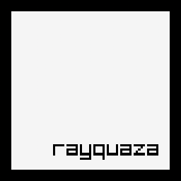

# Rayquaza


[](https://crates.io/crates/rayquaza)
[](https://docs.rs/rayquaza)




Idiomatic wrapper for [raylib](https://www.raylib.com/).

## Usage

Add this to your `Cargo.toml`:

```toml
[dependencies]
rayquaza = "1.0.0-dev.1"
```

## References

* [Learn Rust](https://www.rust-lang.org/learn)
* [Rust API Guidelines](https://rust-lang.github.io/api-guidelines/)
* [raylib website](https://www.raylib.com/)

## License

This project is licensed under either of [Apache License, Version 2.0](LICENSE-APACHE) or [MIT license](LICENSE-MIT) at your option.
