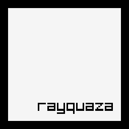

# Rayquaza


[](https://crates.io/crates/rayquaza)
[](https://docs.rs/rayquaza)




Idiomatic wrapper for [raylib](https://www.raylib.com/).

## Features
- No native dependencies: `raylib` is embedded within the program.
- No Cargo dependencies: build dependencies only.
- Multi-platform: `Windows`, `Linux` and `macOS` (tested via CI for the 3 platforms).
- Idiomatic: `Rust` concepts overuse, safe API, follows `Rust` API & style guidelines.

## Usage

Add this to your `Cargo.toml`:

```toml
[dependencies]
rayquaza = "1.0.0-dev.1"
```

## Examples

### Basic window

```rust
use rayquaza::{color::Color, result::Result, window::WindowBuilder};

const TEXT: &str = "Congrats! You created your first window!";
const TEXT_SIZE: i32 = 20;

fn main() -> Result {
    let window = WindowBuilder::new()
        .title("Basic window")
        .resizable()
        .vsync()
        .build()?;
    while !window.should_close() {
        window.draw(|canvas| {
            canvas.clear_background(Color::BLACK);
            canvas.draw_text(
                TEXT,
                window.get_width() / 2 - window.measure_text(TEXT, TEXT_SIZE) / 2,
                window.get_height() / 2 - TEXT_SIZE / 2,
                TEXT_SIZE,
                Color::WHITE,
            );
        });
    }
    Ok(())
}
```

## References

* [Learn Rust](https://www.rust-lang.org/learn)
* [Rust API Guidelines](https://rust-lang.github.io/api-guidelines/)
* [raylib website](https://www.raylib.com/)

## License

This project is licensed under either of [Apache License, Version 2.0](LICENSE-APACHE) or [MIT license](LICENSE-MIT) at your option.
